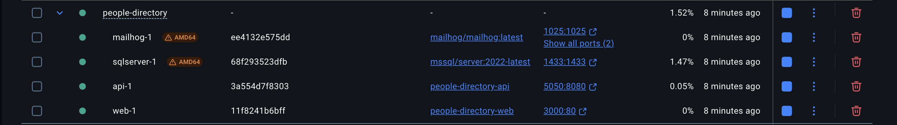
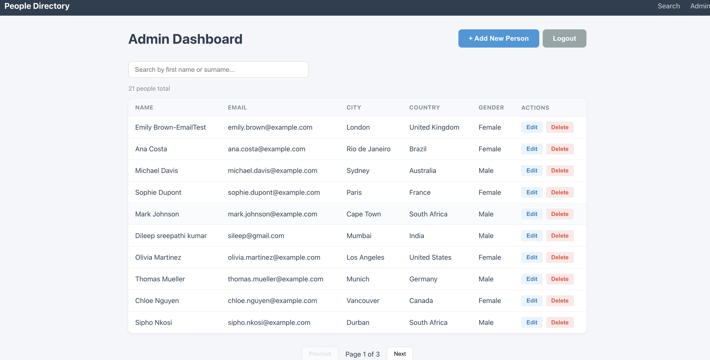
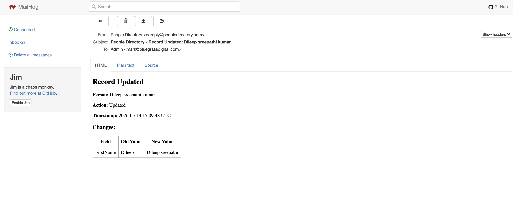

# People Directory Application

A full-stack People Directory application built for the Bluegrass Digital .NET Developer Assessment. The application has two sections: a **Client Section** for searching and viewing people, and an **Admin Section** for managing (CRUD) the people database with email notifications.

## Technology Stack

| Layer | Technology |
|---|---|
| Backend API | .NET 10 Web API (C#) |
| Frontend | React 18 + TypeScript + Vite |
| Database | SQL Server 2022 |
| ORM | Entity Framework Core (Code-First) |
| Authentication | ASP.NET Core Identity + JWT Bearer Tokens |
| Email | SMTP via MailKit (MailHog for dev) |
| Containerisation | Docker + Docker Compose |
| Patterns | Clean Architecture, Repository, Dependency Injection, SOLID |

## Solution Structure

```
PeopleDirectory/
├── docker-compose.yml
├── nginx.conf
│
├── src/
│   ├── PeopleDirectory.Domain/            # Entities, Enums, Interfaces
│   ├── PeopleDirectory.Application/       # DTOs, Services, Validators, Mapping
│   ├── PeopleDirectory.Infrastructure/    # EF DbContext, Repositories, Email, Auth
│   ├── PeopleDirectory.API/               # Controllers, Middleware, Program.cs
│   └── PeopleDirectory.React/             # React SPA (Vite + TypeScript)
│
├── tests/
│   └── PeopleDirectory.UnitTests/
│
└── docs/                                  # Assessment specification PDF
```

## Prerequisites

- [.NET 10 SDK](https://dotnet.microsoft.com/download)
- [Node.js 20+](https://nodejs.org/) and npm
- [Docker Desktop](https://www.docker.com/products/docker-desktop/) (for SQL Server and MailHog)
- A code editor (VS Code, Visual Studio, Rider)

## Getting Started

### Option 1: Docker Compose (Recommended)

Run the entire stack with one command from the project root:

```bash
docker compose up --build
```

This starts four containers:

| Service | Host Port | URL |
|---|---|---|
| React Frontend | `3000` | http://localhost:3000 |
| API (Swagger) | `5050` | http://localhost:5050/swagger |
| SQL Server 2022 | `1433` | `Server=localhost,1433` |
| MailHog SMTP | `1025` | — |
| MailHog Web UI | `8025` | http://localhost:8025 |

> **Note (macOS):** Host port `5050` is used for the API because port `5000` is reserved by macOS AirPlay Receiver. Inside the container the API still listens on `8080` (`5050:8080`).

On first start, the API automatically:
1. Applies EF Core migrations to create the database schema.
2. Seeds 10 countries, 28 cities, 20 sample people, and the admin user.

To stop the stack:

```bash
docker compose down            # stop and remove containers (keeps DB volume)
docker compose down -v         # also wipe the SQL Server data volume
```

### Option 2: Local Development

**1. Start SQL Server and MailHog via Docker:**

```bash
docker compose up sqlserver mailhog -d
```

**2. Run the API:**

```bash
cd src/PeopleDirectory.API
dotnet run
```

The API starts on `http://localhost:5050` (configured in `Properties/launchSettings.json`) with Swagger at `/swagger`.

**3. Run the React frontend:**

```bash
cd src/PeopleDirectory.React
npm install
npm run dev
```

The frontend starts on `http://localhost:5173` and proxies `/api/*` to the backend.

### Working with EF Core Migrations

The initial migration is committed under `src/PeopleDirectory.Infrastructure/Data/Migrations/`. To add a new migration after changing entities:

```bash
dotnet ef migrations add <Name> \
  --project src/PeopleDirectory.Infrastructure \
  --startup-project src/PeopleDirectory.API \
  --output-dir Data/Migrations
```

Migrations are applied automatically on API startup via `db.Database.MigrateAsync()`.

## Database

The application uses **EF Core Code-First** migrations. The database is automatically created and seeded on first run with:
- 10 countries with 28 cities
- 20 sample people records
- 1 admin user
- `Admin` role (ASP.NET Core Identity)

### Seed Admin Credentials

| Field | Value |
|---|---|
| Email | `admin@peopledirectory.com` |
| Password | `Admin@123` |

Use these credentials at http://localhost:3000/login (frontend) or via `POST /api/auth/login` in Swagger.

## API Endpoints

### Public (No Auth Required)

| Method | Endpoint | Description |
|---|---|---|
| GET | `/api/people/search?query={text}` | Type-ahead search (top 10 matches by name) |
| GET | `/api/people?query=&countryId=&cityId=&gender=&page=1&pageSize=10` | Full filtered search with pagination |
| GET | `/api/people/{id}` | Person detail by ID |
| GET | `/api/locations/countries` | All countries for dropdown |
| GET | `/api/locations/countries/{id}/cities` | Cities by country (cascading dropdown) |

### Auth

| Method | Endpoint | Description |
|---|---|---|
| POST | `/api/auth/login` | Login with email/password, returns JWT |
| POST | `/api/auth/refresh` | Refresh expired token |

### Admin (Requires JWT + Admin Role)

| Method | Endpoint | Description |
|---|---|---|
| GET | `/api/admin/people` | List all people (paged) |
| GET | `/api/admin/people/{id}` | Get person for editing |
| POST | `/api/admin/people` | Create new person (multipart form for image) |
| PUT | `/api/admin/people/{id}` | Update person |
| DELETE | `/api/admin/people/{id}` | Soft-delete person |

## Features

### Client Section
- Predictive type-ahead search by first name or last name
- Results grid with summary information
- Filters: Country, City (cascading), Gender
- Person detail page with full profile
- Pagination with total count

### Admin Section
- JWT-based login
- Full CRUD for people records
- Cascading Country → City dropdowns
- Profile picture upload
- Email notifications on create/update (sent to `mark@bluegrassdigital.com`)
- Audit log tracking all changes with old/new values

### Technical Highlights
- Clean Architecture with separate Domain, Application, Infrastructure, API layers
- Repository pattern with generic base implementation
- Dependency Injection throughout
- FluentValidation for DTO validation
- AutoMapper for entity-to-DTO mapping
- Global exception handling middleware
- Serilog structured logging
- Swagger/OpenAPI documentation with JWT Bearer support and XML doc comments
- CORS configured for React dev server
- Docker Compose with SQL Server health checks
- Soft-delete with EF Core global query filters
- EF Core migrations committed to source control

## Screenshots

### Docker Containers

All four services running in Docker Desktop:



### Admin Dashboard

The admin panel with full CRUD, search, and pagination:



### Email Notification (MailHog)

HTML email captured by MailHog showing changed fields with old/new values:



## Verification Checklist (for reviewers)

After `docker compose up --build` the following should all work:

1. **Containers running** — `docker compose ps` shows `api`, `web`, `sqlserver` (healthy) and `mailhog` all `Up`.
2. **Swagger** — open http://localhost:5050/swagger and confirm all endpoints are listed with the **Authorize** (JWT) button.
3. **Public search** — `GET http://localhost:5050/api/people?page=1&pageSize=10` returns 20 seeded people across pages.
4. **Login** — `POST http://localhost:5050/api/auth/login` with the seed admin credentials returns a JWT.
5. **Admin CRUD** — Click **Authorize** in Swagger, paste `Bearer <token>`, then `GET /api/admin/people` returns the list.
6. **Email** — Create or update a person via the admin UI / Swagger, then open http://localhost:8025 \u2014 MailHog shows the HTML notification with old/new values.
7. **Frontend** — http://localhost:3000 loads, type-ahead search works, filters cascade Country \u2192 City, and `/admin` is reachable after login.

## Email Notifications

When a record is created or updated, an HTML email is sent containing:
- The action performed (Created / Updated)
- The person's name
- A table of changed fields with old and new values
- Timestamp

In development, emails are captured by **MailHog** — view them at http://localhost:8025.

## Running Tests

```bash
# Unit tests
dotnet test tests/PeopleDirectory.UnitTests

# All tests
dotnet test
```

## Architecture Decisions

**Why Clean Architecture?** The assessment requires Repository pattern, DI, and SOLID principles. Clean Architecture naturally enforces these by separating concerns into Domain, Application, Infrastructure, and API layers — making the codebase testable and maintainable.

**Why JWT over Cookie sessions?** The React SPA is served from a different origin in development. Token-based auth avoids CORS cookie issues and aligns with the REST API approach.

**Why Code-First EF Core?** Explicitly required by the assessment. Code-First provides full control over the schema via C# entity classes and migrations.

**Why debounce on the client?** A 300ms debounce drastically reduces API calls during rapid typing, improving UX and reducing server load. Server-side rate limiting serves as a safety net.
